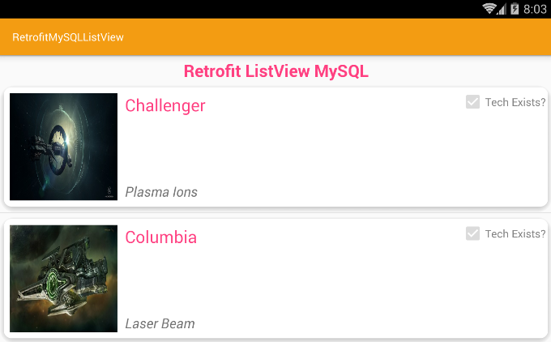

How to retrieve images and text from php mysql using retrofit2 http client and then render them in a listview. Then when the user clicks the listview item we navigate over to the details activity.

Check full tutorial at [Camposha here](http://camposha.info/android/retrofit/mysql/listview).